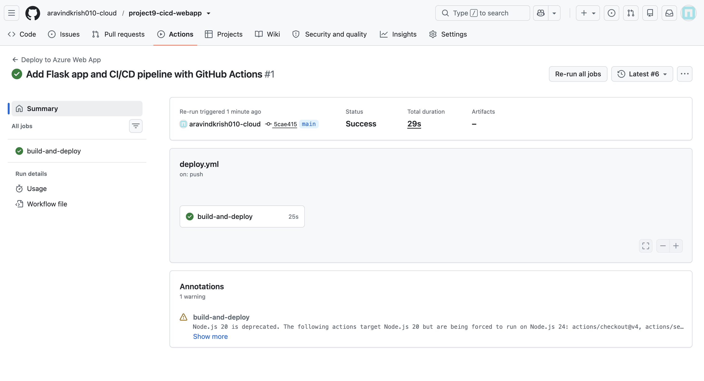
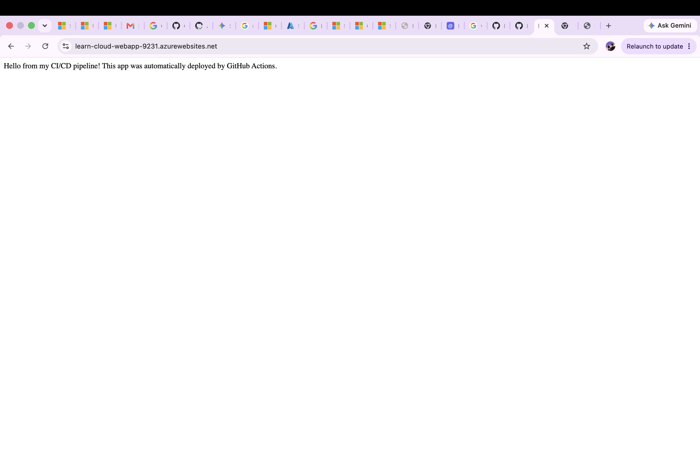

# Project 9: CI/CD Pipeline with GitHub Actions to Azure App Service

## What this project does
Built an automated CI/CD (Continuous Integration/Continuous Deployment) pipeline that automatically builds and deploys a Python Flask app to Azure App Service whenever code is pushed to the `main` branch — no manual deployment commands needed.

## What I learned
- The difference between manual deployment and automated CI/CD pipelines
- How GitHub Actions workflows are structured (triggers, jobs, steps)
- Azure App Service Plans vs Web Apps (the "server tier" vs the actual app)
- How publish profiles authenticate GitHub Actions to deploy to Azure
- Azure now disables "Basic Authentication" by default on new App Services for security — this blocks publish-profile-based deployment until explicitly re-enabled
- Copy-pasting long credentials (like publish profile XML) through a browser UI is error-prone; piping command output directly via GitHub CLI (`gh secret set`) is far more reliable than manual copy-paste
- How to generate a GitHub Personal Access Token with the correct `workflow` scope (required specifically to push `.github/workflows/` files)
- How to reset exposed credentials safely after accidental exposure

## Tools used
- Azure CLI
- GitHub CLI (`gh`)
- GitHub Actions
- Python 3.11 + Flask
- Azure App Service (Free tier)

## How it works
1. `app.py` — a simple Flask app with one route
2. `.github/workflows/deploy.yml` — defines the automation: on every push to `main`, GitHub spins up a temporary Linux runner, installs Python + dependencies, and deploys directly to Azure App Service
3. Authentication handled via a publish profile stored securely as a GitHub Secret (`AZURE_WEBAPP_PUBLISH_PROFILE`)
4. Live app: https://learn-cloud-webapp-9231.azurewebsites.net

## Debugging story
The first deployment attempt failed with: `Publish profile is invalid for app-name and slot-name provided.` After ruling out a typo in the app name, the real cause turned out to be
that Azure disables Basic Authentication by default on new App Services — blocking the exact deployment method GitHub Actions was using. After re-enabling it and still hitting issues from browser copy-paste corruption of the long XML credential, switching to setting the GitHub Secret directly via GitHub CLI (piping Azure's output straight into gh secret set) resolved it completely — avoiding manual copy-paste entirely.

## Proof it works
**Successful GitHub Actions run:**

**Live app response:**

## Cost note
Used Azure App Service Free tier (F1) — $0 cost. Resources torn down after testing.
